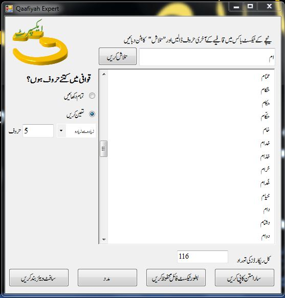
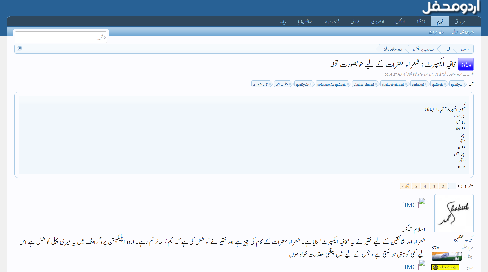

# Changelog

Here you can see all the changes the app has gone through in all these years.

 

### `Latest`

# **Version 2.0.0**

**Released August 8, 2026**

Qaafiyah Expert 2.0 is here! This is a major release that brings a completely refreshed set of tools for poets, including multiple prosody engines, an offline dictionary, a redesigned Bayaz, cloud backup, and a new Islah Workshop.

#### What's New

- **Three Prosody (Aruuz/Taqti) Engines** — Offline Taqti, Aruuz.com, and Rekhta Taqti.
- **HyperDict** — An offline dictionary with support for custom dictionaries, Rekhta Dictionary, and Thesaurus.
- **Redesigned Bayaz** — Unlimited Bayaz entries, custom fonts, image export, and paginated ZIP export.
- **Cloud Backup** — Back up your data using Google Drive or OneDrive.
- **Islah Workshop** — Share your poetry and receive constructive feedback from teachers.
- **Android Shortcuts & Reorderable Tabs** — Quickly access features and customize the tab layout.

---

# **Version 1.2.4**

**Released July 29, 2025**

With a couple of big changes, this is another patch for the version 2. More features are on the way, so stay tuned for the next patch, or maybe another version if the big changes I've planned gets integrated soon enough.

#### What's New

- Regular expression search
- Search for Taqti of a single word
- Search for all words following same feet (wazn)
- Changes according to SDK [requirements](https://developer.android.com/google/play/requirements/target-sdk)
- Pull to refresh functionality to reset the page
- Auto-swtich to feet chip

#### Bug Fixes

- Push notification API fix
- UX improvements for meaning-fetch (used to result in undesired clicks)

 

# **Version 1.2.0**

**Released May 3, 2022**

This was the first update to our app. The main work has been to fix the hanging problem and rewrite rendering logic to optimize the performance.

The version also introduced many new features and loads of bug fixes.
 

 

# **Version 1.1.0**

**Released November 27, 2021**

Feature and performance update.

 

# **Version 1.0.1**

**Released June 2, 2021**

Minor update with bug fixes and improvements.

 

# **Version 1.0.0**

**Released December 6, 2020**

First stable 1.0 release for Android.

 

# **Version 0.0.2**

**Released May 22, 2020**

Early development release with initial improvements.

 

# **Version 0.0.1**

**Released March 1, 2020**

First Android release.

---

 

### `Initial Release`

# **Version 1.1 - Windows**

Back in 2016, a windows software with very basic functions has been released. It only had Urdu support, and a simple interface asking for `rhyme-end` and `number of characters` in the output.

You can have a look at the windows version [here.](https://www.shakeeb.in/2017/01/qaafiyah-expert-by-shakeeb-ahmad.html) A detailed history with discussions has been stored on Urdu Mehfil forum [here.](https://www.urduweb.org/mehfil/threads/%D9%82%D8%A7%D9%81%DB%8C%DB%81-%D8%A7%DB%8C%DA%A9%D8%B3%D9%BE%D8%B1%D9%B9-%D8%B4%D8%B9%D8%B1%D8%A7%D8%A1-%D8%AD%D8%B6%D8%B1%D8%A7%D8%AA-%DA%A9%DB%92-%D9%84%DB%8C%DB%92-%D8%AE%D9%88%D8%A8%D8%B5%D9%88%D8%B1%D8%AA-%D8%AA%D8%AD%D9%81%DB%81.88892/)

I was a college student back then. This version didn't get any updates.

UI

Urdu Mehfil thread (Archived)

 
